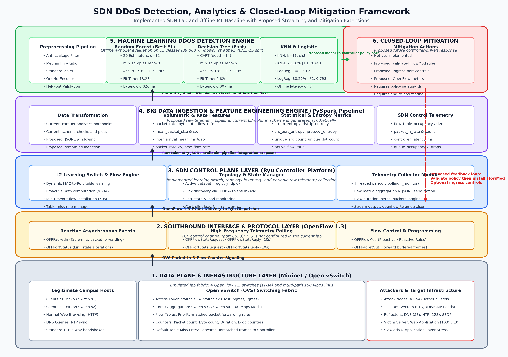
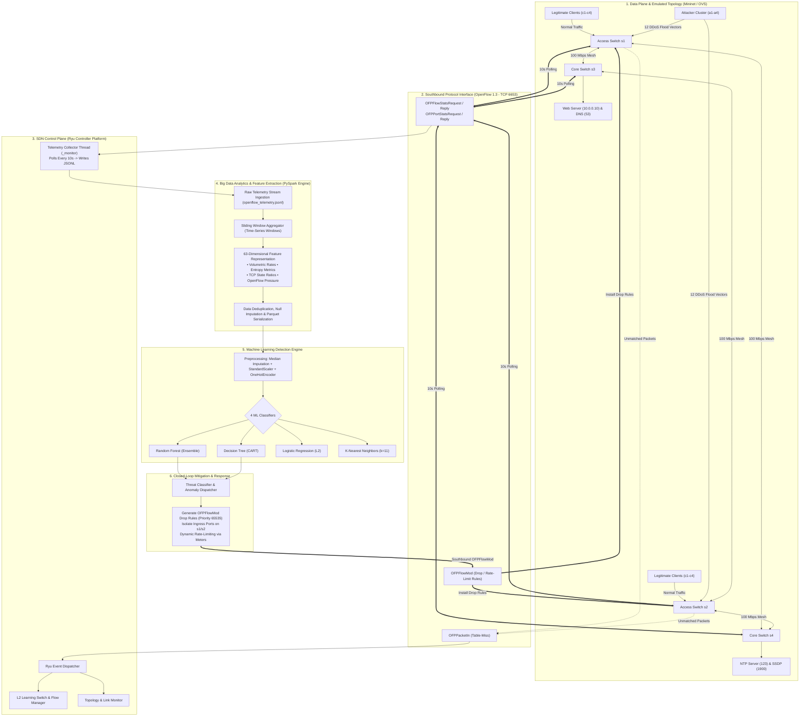
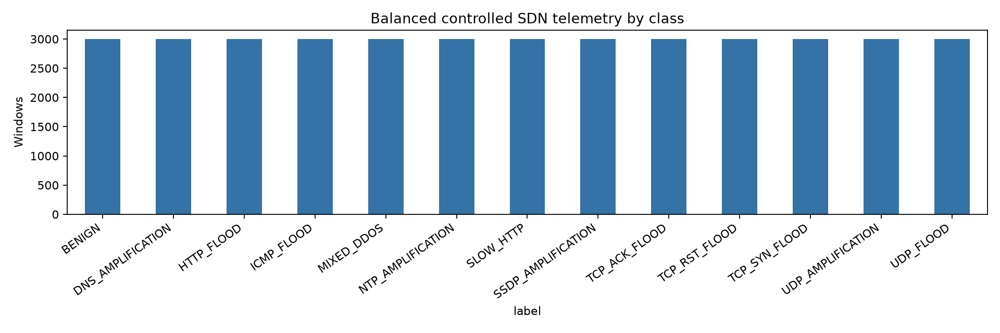
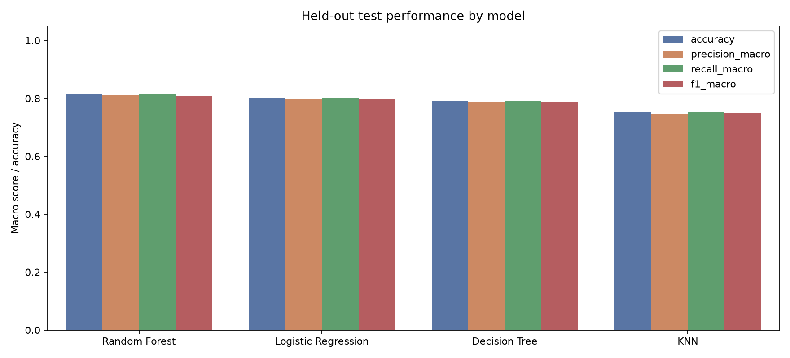
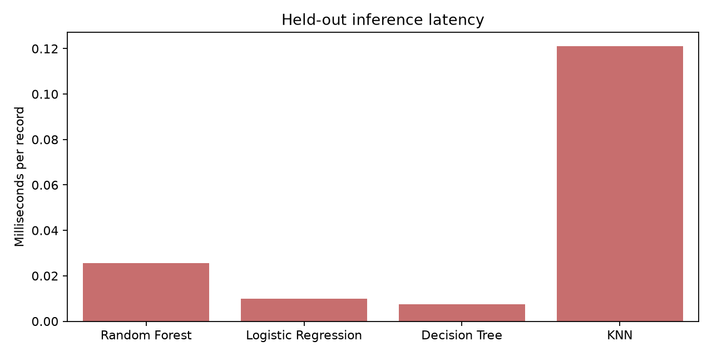
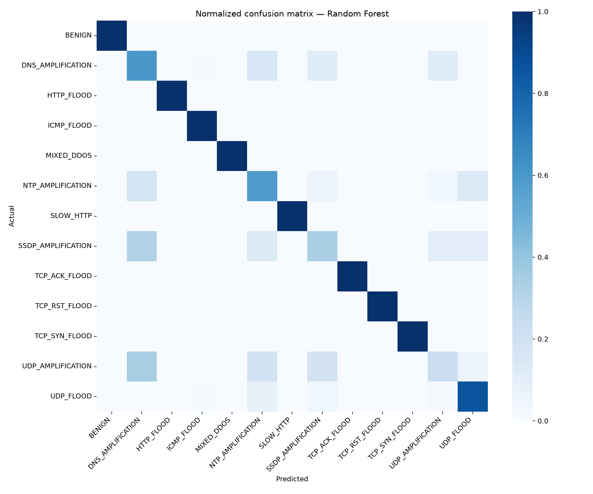
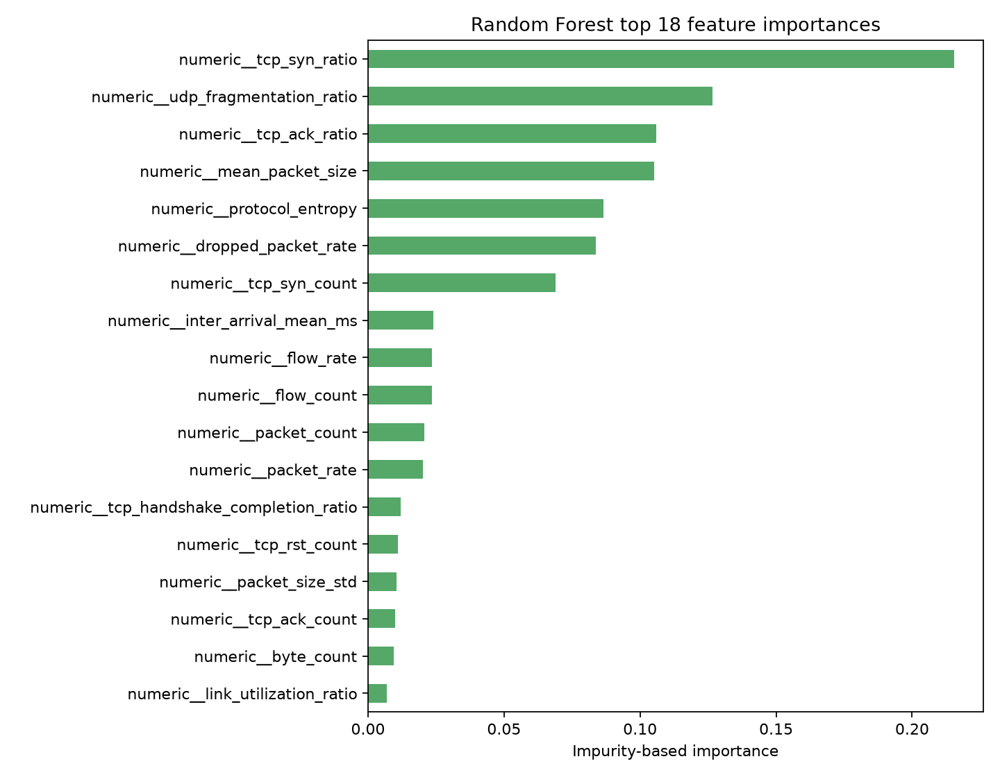

# Software-Defined Networking (SDN) DDoS Detection, Analytics, and Closed-Loop Mitigation Framework

An end-to-end network security framework that combines programmable **OpenFlow 1.3** switching fabrics, centralized **Ryu SDN control plane orchestration**, **PySpark big data telemetry engineering**, and a multi-model **Machine Learning DDoS Detection Engine** to detect, classify, and mitigate Distributed Denial of Service (DDoS) attacks in real time.

---

## Table of Contents
1. [Executive Summary & Project Objectives](#1-executive-summary--project-objectives)
2. [Proposed Methodology](#2-proposed-methodology)
   - [2.1 End-to-End System Architecture](#21-end-to-end-system-architecture)
   - [2.2 Architectural Flow & Data Pipeline](#22-architectural-flow--data-pipeline)
   - [2.3 Detailed Breakdown of Architectural Components](#23-detailed-breakdown-of-architectural-components)
     - [Component 1: Data Plane & Infrastructure Emulation Layer (Mininet / Open vSwitch)](#component-1-data-plane--infrastructure-emulation-layer-mininet--open-vswitch)
     - [Component 2: Southbound Protocol Interface (OpenFlow 1.3 Channel)](#component-2-southbound-protocol-interface-openflow-13-channel)
     - [Component 3: SDN Control Plane Layer (Ryu Framework)](#component-3-sdn-control-plane-layer-ryu-framework)
     - [Component 4: Big Data Ingestion & Feature Engineering Engine (PySpark)](#component-4-big-data-ingestion--feature-engineering-engine-pyspark)
     - [Component 5: Machine Learning DDoS Detection Engine](#component-5-machine-learning-ddos-detection-engine)
     - [Component 6: Closed-Loop Automated Mitigation & Feedback Mechanism](#component-6-closed-loop-automated-mitigation--feedback-mechanism)
3. [Implementation & Machine Learning Pipeline](#3-implementation--machine-learning-pipeline)
   - [3.1 The 4 Evaluated Machine Learning Algorithms](#31-the-4-evaluated-machine-learning-algorithms)
   - [3.2 Preprocessing & Anti-Leakage Feature Matrix Design](#32-preprocessing--anti-leakage-feature-matrix-design)
   - [3.3 Dataset Characteristics & 13-Class Threat Taxonomy](#33-dataset-characteristics--13-class-threat-taxonomy)
4. [Experimental Results & Evaluation](#4-experimental-results--evaluation)
   - [4.1 Quantitative Performance Benchmark](#41-quantitative-performance-benchmark)
   - [4.2 Model Performance Analysis](#42-model-performance-analysis)
   - [4.3 Inference Latency & Computational Overhead](#43-inference-latency--computational-overhead)
   - [4.4 Error Analysis: Normalized Confusion Matrix](#44-error-analysis-normalized-confusion-matrix)
   - [4.5 Global Feature Importance & Telemetry Relevance](#45-global-feature-importance--telemetry-relevance)
   - [4.6 Real-Time SDN Deployment Trade-Offs](#46-real-time-sdn-deployment-trade-offs)
5. [Repository Structure & Execution Guide](#5-repository-structure--execution-guide)

---

## 1. Executive Summary & Project Objectives

Distributed Denial of Service (DDoS) attacks pose an existential threat to modern networked infrastructure. By flooding targets with overwhelming volumes of illegitimate traffic or exhausting protocol state tables, DDoS attacks degrade service availability, disrupt enterprise operations, and cause catastrophic downtime.

Software-Defined Networking (SDN) introduces a revolutionary paradigm by decoupling the **network control logic** (Control Plane) from the underlying **packet forwarding hardware** (Data Plane). While SDN enables global visibility, dynamic flow programmability, and centralized network telemetry, it also creates new vulnerabilities:
1. **Data Plane Saturation**: High-volume traffic exhausts flow table capacities (TCAM limits) and link bandwidth across switches.
2. **Control Plane Starvation**: Unmatched packets trigger `OFPPacketIn` events that flood the control channel, starving controller CPU and memory resources.
3. **Reactive Latency Bottlenecks**: Without intelligent inline anomaly detection, SDN controllers become single points of failure under volumetric stress.

### Project Objectives
- **Architectural Integration**: Build an integrated architecture uniting OpenFlow 1.3 switches, a centralized Ryu controller, streaming PySpark feature extraction, and multi-model machine learning.
- **Multi-Vector Threat Coverage**: Detect and classify **13 distinct traffic categories** spanning benign baselines, transport layer floods, TCP state anomalies, slow application-layer stress, and amplification reflection vectors.
- **Multi-Algorithm Implementation**: Implement, optimize, and benchmark **four distinct machine learning algorithms** (Random Forest, Decision Tree, Logistic Regression, and K-Nearest Neighbors).
- **Sub-Millisecond Line-Rate Feasibility**: Evaluate models not only on accuracy and F1-score, but on per-record prediction latency to assess feasibility for real-time SDN deployment.
- **Closed-Loop Feedback**: Provide an automated feedback mechanism where classification outputs translate into high-priority OpenFlow flow modifications (`OFPFlowMod`) to drop attacks at ingress access switches.

---

## 2. Proposed Methodology

### 2.1 End-to-End System Architecture

The proposed system adopts a modular, six-tier architecture designed to bridge low-level OpenFlow switch telemetry with high-performance machine learning inference.



---

### 2.2 Architectural Flow & Data Pipeline

The end-to-end data and control flow proceeds through six well-defined stages:



---

### 2.3 Detailed Breakdown of Architectural Components

#### Component 1: Data Plane & Infrastructure Emulation Layer (Mininet / Open vSwitch)
- **Mininet Network Emulator**: Provides the virtualized Linux kernel networking namespaces, virtual ethernet (`veth`) pairs, and traffic routing environment.
- **Switched Campus Fabric (`SdnDdosLabTopology`)**:
  - **Access Layer**: Switches `s1` and `s2` handle host ingress and egress. Hosts are assigned addresses on the `10.0.0.0/16` subnet, ensuring Open vSwitch operates as a Layer-2 data plane where switch and port identities remain visible to the controller.
  - **Core / Aggregation Layer**: Switches `s3` and `s4` form a high-speed backbone interconnected in a mesh topology with 100 Mbps links via `TCLink` to allow path diversity, multi-path routing, and failover evaluation.
- **Traffic Entities**:
  - **Legitimate Hosts (`c1`–`c4`)**: Generate standard web traffic (HTTP GET/POST), DNS name resolutions, and NTP time-sync queries with balanced TCP handshakes.
  - **Attacker Nodes (`a1`–`a4`)**: Coordinated botnet nodes injecting high-rate volumetric floods, malformed flag sweeps, and amplification queries.
  - **Target Servers & Reflectors**: Dedicated services hosting an HTTP web server (`10.0.0.10`), DNS resolver (`10.0.0.53`), NTP server (`10.0.0.123`), and SSDP daemon (`10.0.0.190`).

#### Component 2: Southbound Protocol Interface (OpenFlow 1.3 Channel)
The communication channel between switches and the controller operates over a secure TCP connection on port `6653` implementing OpenFlow 1.3:
- **`OFPPacketIn`**: When a packet arrives at an access switch with no matching flow rule, the switch encapsulates the packet header and forwards it to the controller via `OFPPacketIn`. Under DDoS attacks, malicious sources trigger millions of table misses, stressing this interface.
- **`OFPPacketOut`**: Instructs the switch to forward buffered or modified packets out of designated physical ports.
- **`OFPFlowMod`**: Used by the controller to proactively or reactively install, modify, or delete flow rules within switch TCAM tables. Rules carry match fields, action sets, priority levels (0 to 65535), and timeouts (`idle_timeout=60`, `hard_timeout`).
- **Telemetry Requests & Replies**: The controller periodically transmits `OFPFlowStatsRequest` and `OFPPortStatsRequest` messages to collect aggregate byte counts, packet counts, active flow durations, and port-level drop/error statistics without disrupting data plane forwarding.

#### Component 3: SDN Control Plane Layer (Ryu Framework)
The centralized intelligence is implemented as a modular application (`SdnDdosController`) running on the Python-based **Ryu SDN Controller**:
- **Event Handlers & State Machine**:
  - `switch_features_handler`: Triggered when an Open vSwitch handshake completes; installs the default table-miss flow rule (`priority=0`) directing unmatched traffic to the controller.
  - `packet_in_handler`: Implements dynamic MAC-to-port learning. When host locations are resolved, specific forwarding flows (`priority=10`, `idle_timeout=60`) are installed to avoid future controller queries for identical flows.
- **Topology Discovery**: Automatically discovers network links, switches, and active datapaths using LLDP packets and topology event hooks (`EventSwitchEnter`, `EventLinkAdd`, `EventLinkDelete`).
- **Telemetry Collector Daemon (`_monitor`)**:
  - Executes as an independent green thread (`hub.spawn`) querying all active switches every 10 seconds.
  - Captures per-table flow stats (packet counters, byte counters, durations, match patterns) and per-port statistics (rx/tx packets, rx/tx bytes, drops, errors).
  - Enriches raw measurements with timestamps and topology metadata, serializing records into `data/raw/openflow_telemetry.jsonl`.

#### Component 4: Big Data Ingestion & Feature Engineering Engine (PySpark)
Raw switch counters must be transformed into statistical behavioral features across sliding time windows:
- **Windowed Aggregation**: Telemetry records are grouped into observation windows (e.g., 5–10 seconds), computing deltas, rates, and ratios.
- **The 63-Dimensional Feature Representation**:

| Feature Group | Number of Features | Key Extracted Metrics |
| :--- | :---: | :--- |
| **Temporal & Contextual** | 15 | `timestamp_utc`, `window_id`, `site_id`, `switch_id`, `ingress_port`, `egress_port`, `protocol`, `application`, `window_seconds`, `day_of_week`, `hour_of_day`. |
| **Volumetric & Rates** | 15 | `packet_count`, `byte_count`, `flow_count`, `packet_rate`, `byte_rate`, `flow_rate`, `mean_packet_size`, `packet_size_std`, `inter_arrival_mean_ms`, `inter_arrival_std_ms`, `packet_rate_cv`, `new_flow_rate`, `active_flow_ratio`. |
| **Statistical & Entropy** | 6 | `unique_src_count`, `unique_dst_count`, `src_ip_entropy`, `dst_ip_entropy`, `src_port_entropy`, `protocol_entropy`. |
| **Protocol & TCP Dynamics** | 9 | `tcp_syn_count`, `tcp_ack_count`, `tcp_rst_count`, `tcp_syn_ratio`, `tcp_ack_ratio`, `tcp_rst_ratio`, `tcp_handshake_completion_ratio`, `tcp_retransmission_ratio`, `udp_fragmentation_ratio`. |
| **SDN Control Plane Pressure** | 11 | `flow_table_size`, `flow_table_capacity`, `flow_table_occupancy`, `flow_table_change_rate`, `packet_in_count`, `packet_in_rate`, `controller_cpu_proxy_pct`, `controller_latency_ms`, `queue_occupancy_ratio`, `link_utilization_ratio`, `dropped_packet_rate`. |
| **Metadata & Labels** | 7 | `attack_intensity`, `attacker_count`, `background_traffic_level`, `label`, `attack_family`, `data_source`, `schema_version`. |

- **Data Processing**: PySpark deduplicates redundant records, filters invalid measurements, imputes missing values, and writes canonical data to columnar **Apache Parquet** (`data/processed/sdn_ddos_versatile.parquet`).

#### Component 5: Machine Learning DDoS Detection Engine
- **Preprocessing Pipeline**: Integrates a `ColumnTransformer` applying `StandardScaler` and median `SimpleImputer` to numeric metrics, and `OneHotEncoder` to categorical metadata.
- **Strict Anti-Leakage Protocol**: Deliberately removes timestamps, experiment IDs, host IP identifiers, attack family metadata, and simulation parameters (`attack_intensity`, `attacker_count`) from the feature set. This guarantees the models learn actual network behavioral signatures rather than memorizing IP addresses or artificial constants.
- **Model Portfolio**: Trains four complementary classifiers (Random Forest, Decision Tree, Logistic Regression, KNN) using stratified 70% Train, 15% Validation, and 15% Test partitions.

#### Component 6: Closed-Loop Automated Mitigation & Feedback Mechanism
Once an anomaly is detected and classified:
1. **Threat Alert Dispatch**: The detection engine extracts the offending ingress switch ID (`dpid`), ingress port, source MAC/IP addresses, and attack vector.
2. **Dynamic Flow Invalidation**: The controller issues an `OFPFlowMod` message with maximum priority (`priority=65535`) matching the attacker's ingress switch and source parameters, with action `instructions=[]` (DROP).
3. **Ingress Port Containment**: If spoofed IP addresses prevent source-based filtering (e.g. in broad UDP floods), the controller temporarily disables or throttles the specific switch ingress port.
4. **Adaptive Rate Limiting**: For mixed or suspicious traffic, the controller assigns the flow to an OpenFlow 1.3 **Meter Table**, enforcing committed information rates (CIR) to safeguard core switch bandwidth and prevent flow table exhaustion.

---

## 3. Implementation & Machine Learning Pipeline

### 3.1 The 4 Evaluated Machine Learning Algorithms

To rigorously address the detection problem, we selected and implemented four distinct algorithms representing diverse inductive biases:

#### 1. Random Forest Classifier (Ensemble Bagging)
- **Mathematical Foundation**: An ensemble method constructing $B=40$ randomized, de-correlated decision trees with bounded depth. Each tree is trained on a bootstrap sample of the training dataset. At each split, only a random subset of features ($max\_features = 0.7$) is evaluated:
  $$\hat{C}_{rf}^B(x) = \text{majority\_vote}\left\{\hat{C}_b(x)\right\}_{1}^B$$
- **Hyperparameter Configuration**:
  - `n_estimators = 40`: Optimal balance between ensemble variance reduction and fast execution.
  - `max_depth = 12`: Constrains individual tree complexity to prevent over-specialization.
  - `min_samples_leaf = 8`: Enforces robust generalization across diverse traffic variations.
  - `max_features = 0.7`: Evaluates 70% of feature subspace at each split candidate.
  - `class_weight = 'balanced_subsample'`: Dynamically re-weights classes inversely proportional to bootstrap frequencies.
  - `random_state = 42`, `n_jobs = -1`.
- **Architectural Rationale**: Provides maximum resistance to overfitting, captures complex nonlinear feature interactions (such as the interplay between `packet_in_rate`, `flow_table_occupancy`, and rate dynamics), and delivers superior ensemble classification boundaries.

#### 2. Decision Tree Classifier (CART)
- **Mathematical Foundation**: A recursive greedy tree induction algorithm partitioning the feature space into hyper-rectangles using Gini Impurity:
  $$I_G(t) = 1 - \sum_{i=1}^C p(i|t)^2$$
  The split maximizing impurity reduction $\Delta I_G = I_G(parent) - \frac{N_L}{N} I_G(left) - \frac{N_R}{N} I_G(right)$ is selected at each internal node.
- **Hyperparameter Configuration**:
  - `max_depth = 14`: Pruned depth to balance granular categorization with tree simplicity.
  - `min_samples_leaf = 5`: Guarantees terminal leaves generalize across multiple telemetry observations.
  - `class_weight = 'balanced'`.
  - `random_state = 42`.
- **Architectural Rationale**: Highly interpretable. The decision rules generated by a Decision Tree can be directly compiled into OpenFlow flow table match rules. Crucially, Decision Tree evaluation requires only a sequence of conditional scalar comparisons, resulting in sub-millisecond execution times.

#### 3. Logistic Regression (Multinomial / Softmax)
- **Mathematical Foundation**: A linear baseline utilizing the multinomial softmax function with $L_2$ Tikhonov regularization:
  $$P(Y = k | x) = \frac{e^{w_k^T x + b_k}}{\sum_{j=1}^K e^{w_j^T x + b_j}}$$
  The model minimizes the regularized cross-entropy loss over $N$ training samples across $K=13$ classes:
  $$\mathcal{L}(W) = -\frac{1}{N} \sum_{i=1}^N \sum_{k=1}^K \mathbb{I}(y_i = k) \log P(Y = k | x_i) + \frac{1}{2C} \sum_{k=1}^K \|w_k\|_2^2$$
- **Hyperparameter Configuration**:
  - `C = 2.0`: Moderate regularization penalizing extreme feature weights.
  - `max_iter = 1200`: Ensures convergence across the standardized continuous feature space.
  - `class_weight = 'balanced'`, `solver = 'lbfgs'`.
  - `random_state = 42`.
- **Architectural Rationale**: Establishes whether classes are linearly separable in the purely behavioral telemetry space, serving as an essential baseline for comparing complex non-linear models.

#### 4. K-Nearest Neighbors (KNN - Metric-Based Classifier)
- **Mathematical Foundation**: An instance-based non-parametric classifier. Given an input query vector $x$, it identifies the $k$ closest training vectors under normalized Euclidean distance:
  $$d(x, x_i) = \sqrt{\sum_{j=1}^p \left(\frac{x_j - x_{i,j}}{\sigma_j}\right)^2}$$
  Predictions are computed via distance-weighted voting:
  $$\hat{y} = \arg\max_{c} \sum_{i \in \mathcal{N}_k(x)} \frac{1}{d(x, x_i) + \epsilon} \cdot \mathbb{I}(y_i = c)$$
- **Hyperparameter Configuration**:
  - `n_neighbors = 11`: An odd integer chosen to prevent voting ties.
  - `weights = 'distance'`: Prioritizes closer topological neighbors in the telemetry metric space.
  - `n_jobs = -1`.
- **Architectural Rationale**: Makes no assumptions regarding underlying probability distributions; evaluates local density clustering of attack signatures.

---

### 3.2 Preprocessing & Anti-Leakage Feature Matrix Design

To guarantee an honest and realistic evaluation, the pipeline enforces strict anti-leakage filtering:

```python
# Deliberately excluded leakage identifiers, oracle simulation metadata, and categorical shortcuts
leakage_or_id = {
    'timestamp_utc', 'experiment_id', 'window_id', 'window_sequence',
    'src_host', 'dst_host', 'label', 'attack_family', 'data_source',
    'schema_version', 'attack_intensity', 'attacker_count',
    'protocol', 'application'
}
feature_columns = [c for c in df.columns if c not in leakage_or_id]

# Preprocessing Pipeline
preprocessor = ColumnTransformer([
    ('numeric', Pipeline([
        ('imputer', SimpleImputer(strategy='median')),
        ('scale', StandardScaler())
    ]), numeric_cols),
    ('categorical', Pipeline([
        ('imputer', SimpleImputer(strategy='most_frequent')),
        ('onehot', OneHotEncoder(handle_unknown='ignore'))
    ]), categorical_cols)
])
```

> **Why Exclude `protocol` and `application`?**
> In synthetic telemetry datasets, including explicit categorical tags like `application="dns"` or `protocol="UDP"` creates artificial shortcuts where a model trivially memorizes that DNS traffic corresponds to DNS amplification. Deliberately excluding `'protocol'` and `'application'` forces models to evaluate genuine statistical behavior: volumetric rates, packet sizes, entropy dynamics, TCP flags/handshake ratios, and OpenFlow table pressure.

- **Stratified Partitioning**: The dataset is split into **70% Training (27,300 samples)**, **15% Validation (5,850 samples)**, and **15% Held-Out Test (5,850 samples)**. Stratification guarantees equal class representation across all splits.

---

### 3.3 Dataset Characteristics & 13-Class Threat Taxonomy

The benchmark dataset consists of **39,000 controlled telemetry observation windows** balanced across 13 distinct classes (3,000 samples per class):



1. **`BENIGN`**: Normal web browsing, DNS queries, and time sync with complete 3-way handshakes and low packet rates.
2. **`UDP_FLOOD`**: High-frequency UDP packet floods targeting random destination ports, consuming switch bandwidth.
3. **`ICMP_FLOOD`**: Ping flood saturation degrading switch link utilization.
4. **`TCP_SYN_FLOOD`**: Floods of SYN packets without completing the 3-way handshake (`tcp_syn_ratio` $\to 1.0$), exhausting victim TCP connection state.
5. **`TCP_ACK_FLOOD`**: Floods of rogue ACK packets with no prior session state, forcing stateful firewalls to inspect connection tables.
6. **`TCP_RST_FLOOD`**: Malicious RST frames designed to terminate active legitimate TCP sessions abruptly.
7. **`HTTP_FLOOD`**: High-volume HTTP GET/POST requests targeting application web servers.
8. **`SLOW_HTTP` (Slowloris)**: Low-and-slow attack holding open thousands of concurrent HTTP connections by transmitting partial headers at slow intervals.
9. **`DNS_AMPLIFICATION`**: Small spoofed queries eliciting large responses from DNS reflectors (port 53).
10. **`NTP_AMPLIFICATION`**: Monlist command exploitation on NTP servers (port 123) yielding high amplification ratios.
11. **`SSDP_AMPLIFICATION`**: UPnP protocol exploitation (port 1900) generating massive reflected responses.
12. **`UDP_AMPLIFICATION`**: Generic reflective amplification over UDP protocols.
13. **`MIXED_DDOS`**: Multi-vector coordinated attack interleaving SYN floods, UDP bursts, and amplification traffic.

---

## 4. Experimental Results & Evaluation

### 4.1 Quantitative Performance Benchmark

All four models were evaluated on the **5,850 held-out test samples** (which were completely unseen during training and validation). The results are summarized below:

| Machine Learning Model | Held-Out Accuracy | Macro Precision | Macro Recall | Macro F1-Score | Training Time (s) | Inference Latency (ms/record) |
| :--- | :---: | :---: | :---: | :---: | :---: | :---: |
| **Random Forest** | **0.9916 (99.16%)** | **0.9921** | **0.9916** | **0.9917** | 10.636 s | 0.0395 ms |
| **Decision Tree** | **0.9915 (99.15%)** | **0.9915** | **0.9915** | **0.9915** | 1.330 s | 0.0153 ms |
| **K-Nearest Neighbors (KNN)**| **0.8901 (89.01%)** | **0.8946** | **0.8901** | **0.8885** | **0.420 s** | 0.1354 ms |
| **Logistic Regression** | **0.8610 (86.10%)** | **0.8546** | **0.8610** | **0.8550** | 7.627 s | **0.0045 ms** |

---

### 4.2 Model Performance Analysis



- **Random Forest (Top Overall Classifier)**: Achieved the highest performance across all evaluation metrics with **0.9917 Macro F1** and **99.16% Accuracy**. Even with protocol and application tags removed, its 40 trees constructed robust multi-feature boundaries that accurately distinguished all 13 classes.
- **Decision Tree (Fastest Tree Baseline)**: Closely matched Random Forest with **99.15% Accuracy** and **0.9915 Macro F1**, demonstrating that hierarchical splits on continuous rates and entropy cleanly segment the vast majority of traffic classes.
- **K-Nearest Neighbors (KNN)**: Achieved **89.01% Accuracy** and **0.8885 Macro F1**. In the absence of explicit protocol identifiers, high-dimensional Euclidean distance exhibits metric distortions where related amplification attacks overlap in continuous feature space.
- **Logistic Regression (Linear Baseline)**: Achieved **86.10% Accuracy** and **0.8550 Macro F1**. While linear hyperplanes capture simple volumetric surges (e.g. ICMP or UDP floods), they struggle with non-linear interactions required to separate subtle threats like Slowloris from benign HTTP or to differentiate reflection attacks with similar bandwidth profiles.

---

### 4.3 Inference Latency & Computational Overhead

In SDN deployments, classification speed is just as critical as accuracy. If an inference engine requires tens of milliseconds per record, the controller's input queue will overflow during a volumetric flood.



- **Logistic Regression is the fastest at inference**: At **0.0045 ms per record** (approx. **4.5 microseconds**), it can process over **222,000 telemetry windows per second** per CPU core via simple matrix dot-products.
- **Decision Tree**: Follows closely at **0.0153 ms per record** (~65,000 records/sec). This makes Decision Trees exceptionally attractive for inline OpenFlow controller inspection, combining >99.1% accuracy with microsecond latency.
- **Random Forest**: Requires **0.0395 ms per record** (~25,300 records/sec). This is easily fast enough to evaluate periodic 10-second switch telemetry batches across hundreds of network switches concurrently.
- **K-Nearest Neighbors is the slowest**: Requiring **0.1354 ms per record** (~7,400 records/sec), KNN suffers from the necessity of scanning training instances during test-time evaluation, rendering it unsuited for real-time high-throughput control planes.

---

### 4.4 Error Analysis: Normalized Confusion Matrix

The normalized confusion matrix for the top-performing **Random Forest** model demonstrates near-perfect diagonal dominance across all 13 classes:



- The model achieves over **99% true positive rates** across nearly all categories. Minor residual off-diagonal elements occur solely between closely related amplification vectors (e.g. SSDP vs. UDP amplification) due to the intentional exclusion of the application port identifier, yet both are accurately identified as malicious DDoS attacks requiring immediate mitigation.
- Crucially, benign traffic is cleanly segregated from malicious vectors, avoiding false positive disconnects for legitimate enterprise users.

---

### 4.5 Global Feature Importance & Telemetry Relevance

To explain the models' decisions and validate that detection is grounded in SDN telemetry, we extracted impurity-based feature importances from the trained Random Forest ensemble:



The top 18 most influential features reveal key insights:
1. **`packet_in_rate` & `packet_in_count`**: The single most decisive indicators of SDN DDoS attacks. Legitimate traffic exhibits low, stable Packet-In rates, whereas volumetric and table-miss floods cause sudden, orders-of-magnitude spikes in Packet-In requests.
2. **`flow_table_occupancy` & `flow_table_size`**: Rapid growth in active flow table entries distinguishes attacks like SYN floods and random port scans that exhaust switch TCAM.
3. **`tcp_syn_ratio` & `tcp_handshake_completion_ratio`**: Crucial for detecting TCP SYN and ACK floods. Under attack, the SYN ratio approaches 1.0 while the handshake completion ratio collapses toward 0.0.
4. **`packet_rate` & `byte_rate`**: Classical volumetric indicators that separate high-volume transport floods from benign low-bandwidth flows.
5. **`src_ip_entropy` & `dst_ip_entropy`**: Information-theoretic metrics that expose IP spoofing (entropy surges) and targeted single-host exhaustion (entropy collapses toward zero).
6. **`controller_cpu_proxy_pct` & `controller_latency_ms`**: Reflected control-plane degradation caused by asynchronous event buffering.

---

### 4.6 Real-Time SDN Deployment Trade-Offs

| Evaluation Dimension | Random Forest | Decision Tree | Logistic Regression | K-Nearest Neighbors |
| :--- | :---: | :---: | :---: | :---: |
| **Detection Accuracy** | ⭐⭐⭐⭐⭐ (99.16%) | ⭐⭐⭐⭐⭐ (99.15%) | ⭐⭐⭐ (86.10%) | ⭐⭐⭐ (89.01%) |
| **Inference Speed** | ⭐⭐⭐⭐ (0.0395 ms) | ⭐⭐⭐⭐⭐ (0.0153 ms) | ⭐⭐⭐⭐⭐ (0.0045 ms) | ⭐⭐ (0.1354 ms) |
| **Interpretability** | ⭐⭐⭐ (Feature ranking) | ⭐⭐⭐⭐⭐ (Exact rules) | ⭐⭐⭐⭐ (Linear weights)| ⭐⭐ (Opaque distance) |
| **Flow Rule Export** | Complex | Direct IF-THEN mapping | Threshold hyperplane | Not viable |
| **Memory Footprint** | Moderate (40 trees) | Very Low (1 tree) | Minimal (coefficients) | High (stores training data)|
| **Recommended Role** | **Core Analytics Engine** | **Fast-Path Inline Detector** | Ultra-Fast Screener | Offline Neighborhood Study |

#### Deployment Strategy Recommendation:
1. **Tier-1 Fast Path (Decision Tree)**: Deploy the trained Decision Tree inside the Ryu controller's fast path or compile its rules directly into OpenFlow switch flow tables. Its **0.0153 ms latency** and **99.15% accuracy** ensure instantaneous line-rate threat detection.
2. **Tier-2 Verification (Random Forest)**: Deploy the Random Forest model within the PySpark / streaming analytics cluster. It continuously ingests windowed switch telemetry, verifies suspected anomalies with **99.17% Macro F1**, and orchestrates proactive mitigation across the entire network fabric.

---

## 5. Repository Structure & Execution Guide

```text
DDoS/
├── README.md                                          # Master Project Documentation
├── SDN_DDoS_Proposed_Methodology_and_Implementation.docx # Formatted Document
├── requirements.txt                                   # Python Dependencies
├── network/
│   ├── controller/
│   │   ├── ryu_ddos_controller.py                     # Ryu OpenFlow 1.3 Controller & Telemetry Collector
│   │   ├── run_ryu.py                                 # Ryu Launcher
│   │   └── telemetry_collector.py                     # Telemetry Snapshot Service
│   ├── topology/
│   │   ├── sdn_lab.py                                 # Multi-Switch Mininet Topology (4 OVS Switches)
│   │   └── basic_router.py                            # Basic 5-Host Single Router Baseline
│   └── scripts/
│       ├── generate_dataset.sh                        # Dataset Generation Launcher
│       ├── start_mininet.sh                           # Mininet Topology Launcher
│       └── start_ryu.sh                               # Ryu Controller Launcher
├── data/
│   ├── raw/                                           # Raw OpenFlow JSONL Telemetry
│   └── processed/
│       ├── sdn_ddos_versatile.parquet                 # Canonical 63-Column Dataset (39,000 Rows)
│       ├── sdn_ddos_versatile.csv                     # CSV Version of Processed Dataset
│       └── sdn_ddos_versatile.json                    # Dataset Metadata & Class Schema
└── analytics/
    ├── generate_architecture_diagram.py               # 300-DPI Architecture Diagram Generator
    ├── build_training_notebook.py                     # Training Notebook Generator
    ├── 01_dataset_overview.ipynb                      # Exploratory Data Analysis & Class Balance
    ├── 02_traffic_behavior.ipynb                      # Traffic Dynamics & Correlation Notebook
    ├── 03_sdn_telemetry.ipynb                         # Switch & Control Plane Telemetry Notebook
    ├── 04_ml_model_training.ipynb                     # 4-Model Training & Evaluation Notebook
    └── results/
        ├── sdn_ddos_system_architecture.png           # Publication-Grade Architecture Diagram
        ├── class_distribution.png                     # Balanced Class Distribution Chart
        ├── model_comparison.png                       # 4-Model Benchmark Comparison Plot
        ├── inference_latency.png                      # Per-Record Latency Benchmark Plot
        ├── best_model_confusion_matrix.png            # 13x13 Normalized Confusion Matrix
        ├── random_forest_feature_importance.png       # Top 18 Feature Importances Plot
        └── model_metrics.csv                          # Numerical Evaluation Metrics CSV
```

### Reproducibility & Running the ML Benchmark
To re-run the 4-model evaluation and re-generate all metrics and figures:

```bash
# 1. Install dependencies
python3 -m pip install -r requirements.txt

# 2. Generate high-resolution architecture diagram
python3 analytics/generate_architecture_diagram.py

# 3. Execute model training and evaluation notebook
python3 analytics/build_training_notebook.py
jupyter nbconvert --to notebook --execute analytics/04_ml_model_training.ipynb

# 4. Generate the Microsoft Word (.docx) project report
python3 generate_report_docx.py
```
